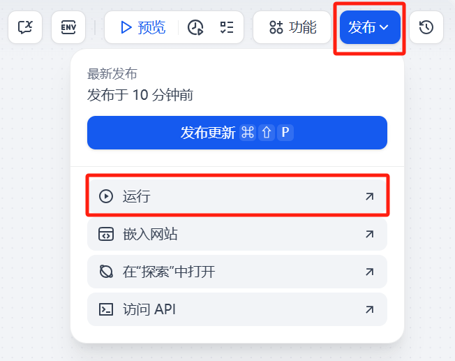

# Dify 智能体：工作流的调试与发布

## 工作流调试

在完成或部分完成工作流的搭建后，可以通过以下方式进行调试。

### 1. 调试完整工作流

- 点击 **“运行”** 或 **“预览”** 按钮，即可执行整个工作流。
- 调试过程中，Dify 会展示：
  - 每个模块的执行状态（成功 / 失败）
  - 模块的运行耗时
  - 输入与输出变量信息

这种方式适用于整体流程的集成测试，帮助检查模块之间的数据流是否正常。

### 2. 调试单个模块

- 即使工作流尚未完全连接，也可以调试单个模块。
- 点击所需测试的模块，运行该模块，输入测试数据后查看执行结果。
- 适用于在开发过程中逐步验证模块逻辑，快速排查问题。

## 工作流发布

工作流调试完成后，常见的发布方式包括两种：通过 Web 页面直接运行，或以 API 接口形式集成到其他系统中。

### 1. 直接运行

**Step1. 发布模型**
- 点击右上角的「发布」按钮，选择「运行」，即可通过 Dify 的 Web 控制台直接运行工作流。

**Step2. Web页面运行** 
- 发布后，工作流可通过 Dify 提供的 Web 页面直接访问运行，适合用于交互体验、演示验证等场景。

> ⚠️ **注意事项：**
>
> - 若工作流中的大语言模型（LLM）模块使用自定义 API 密钥，Web 页面访问将消耗对应的大模型调用额度，请留意使用频率与成本。
> - 若不希望该工作流通过 Web 页面对外公开访问，可在该工作流的「监测」页面将其**停用**，以关闭该工作流的公开访问入口。

### 2. API 接入说明

**Step1. 访问API**
如果希望将工作流嵌入到业务系统或程序中，可通过 API 调用已发布的工作流。

**Step2. 获取调用信息**
   - 点击右上角「API 密钥」，生成调用凭证。
   - 同时可查看详细的 API 接口文档说明。

**Step3. 确认 Base URL**
   - 默认格式为：`https://api.dify.ai/v1`
>    - ⚠️**注意事项：** 如果使用了本地或私有化部署，并修改了端口号，请同步调整 URL 中的端口信息。

